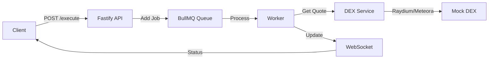

# Design Decisions

This document explains the key technical decisions made in building the Order Execution Engine and the rationale behind them.

## Architecture Overview

The Order Execution Engine is designed as a high-performance, scalable backend system for executing token swaps on Solana. The architecture follows a queue-based processing model with real-time WebSocket updates.



## Key Design Decisions

### 1. Fastify over Express

**Decision:** Use Fastify as the web framework instead of Express.

**Rationale:**
- **Performance**: Fastify is ~65% faster than Express in benchmarks
- **TypeScript Support**: First-class TypeScript support out of the box
- **Schema Validation**: Built-in JSON schema validation with Ajv
- **WebSocket Support**: Native WebSocket support via `@fastify/websocket`
- **Modern Architecture**: Async/await first, better error handling

**Trade-offs:**
- Smaller ecosystem compared to Express
- Slightly steeper learning curve
- Less community resources

### 2. BullMQ + Redis for Queue Management

**Decision:** Use BullMQ with Redis for order queue processing.

**Rationale:**
- **Reliability**: BullMQ provides robust job processing with retries and failure handling
- **Scalability**: Redis-backed queues can handle high throughput
- **Priority Support**: Built-in priority queue for urgent orders
- **Observability**: Job status tracking and monitoring
- **Persistence**: Redis ensures jobs aren't lost on server restart

**Implementation Details:**
- Queue processes orders asynchronously
- Worker polls queue and executes orders
- Fallback to in-memory queue when Redis is unavailable (development mode)

**Trade-offs:**
- Requires Redis infrastructure (Docker for local dev)
- Additional complexity vs simple in-memory processing
- Network latency for Redis operations

### 3. Mock DEX vs Real DEX Integration

**Decision:** Implement mock DEX routing for Raydium and Meteora instead of real blockchain integration.

**Rationale:**
- **Development Speed**: Faster iteration without blockchain dependencies
- **Testing**: Easier to test without real transactions
- **Cost**: No transaction fees during development
- **Reliability**: No dependency on external DEX APIs or blockchain state
- **Demonstration**: Sufficient for showcasing routing logic and system architecture

**Mock Implementation:**
- Simulates price quotes with realistic variations
- Random selection between Raydium/Meteora to demonstrate routing
- Generates mock transaction hashes
- Configurable delays to simulate network latency

**Production Path:**
- Replace `DexService` with real Solana SDK integration
- Use Jupiter Aggregator API for actual routing
- Implement wallet signing and transaction submission
- Add transaction confirmation polling

### 4. WebSocket for Real-Time Updates

**Decision:** Use WebSocket connections for order status updates instead of polling.

**Rationale:**
- **Real-Time**: Instant updates when order status changes
- **Efficiency**: Lower bandwidth than HTTP polling
- **User Experience**: Better UX with immediate feedback
- **Scalability**: Server can push updates to many clients efficiently

**Implementation:**
- Client connects to `/ws/:orderId` after submitting order
- Server stores connection in `orderConnections` Map
- Worker sends status updates through WebSocket
- Connection cleanup on close/error

**Trade-offs:**
- More complex than simple HTTP polling
- Requires connection management and cleanup
- Potential memory issues if connections aren't cleaned up

### 5. TypeScript for Type Safety

**Decision:** Use TypeScript throughout the codebase.

**Rationale:**
- **Type Safety**: Catch errors at compile time
- **Developer Experience**: Better IDE autocomplete and refactoring
- **Documentation**: Types serve as inline documentation
- **Maintainability**: Easier to refactor and maintain

**Configuration:**
- Strict mode enabled for maximum type safety
- CommonJS modules for Node.js compatibility
- Source maps for debugging

### 6. In-Memory WebSocket Store

**Decision:** Store WebSocket connections in a Map instead of Redis.

**Rationale:**
- **Simplicity**: Direct access to WebSocket objects
- **Performance**: No serialization/deserialization overhead
- **Statefulness**: WebSocket connections are inherently stateful

**Limitations:**
- Not suitable for multi-instance deployments
- Connections lost on server restart
- For production: Consider Redis pub/sub or Socket.io with Redis adapter

### 7. Separation of Concerns

**Decision:** Separate code into distinct layers: routes, services, queue, types.

**Rationale:**
- **Maintainability**: Easy to locate and modify specific functionality
- **Testability**: Each layer can be tested independently
- **Scalability**: Easy to extract services into microservices later

**Structure:**
```
src/
├── routes/       # API endpoints
├── services/     # Business logic (DEX)
├── queue/        # Queue producer & worker
├── types/        # TypeScript type definitions
└── websocket.store.ts  # Shared WebSocket state
```

## Performance Considerations

### Queue Processing
- Worker processes one order at a time to ensure sequential execution
- Can be scaled horizontally by adding more worker instances
- Priority queue allows urgent orders to jump ahead

### WebSocket Connections
- Connections stored in memory for fast access
- Automatic cleanup on disconnect prevents memory leaks
- Consider connection limits for production (e.g., max 10,000 concurrent)

### DEX Routing
- Parallel quote fetching from multiple DEXs (Raydium + Meteora)
- Best price selection happens in ~100ms (simulated)
- Real implementation would use Jupiter Aggregator for optimal routing

## Security Considerations

### Input Validation
- Amount validation (must be positive)
- Type checking via TypeScript
- Schema validation via Fastify (future enhancement)

### Error Handling
- Graceful degradation when Redis is unavailable
- WebSocket error handling and cleanup
- Worker retry logic for failed orders

### Future Enhancements
- Rate limiting per IP/user
- Authentication and authorization
- Order amount limits
- Wallet signature verification

## Testing Strategy

### Unit Tests
- DEX service quote logic
- Routing algorithm
- Input validation

### Integration Tests
- End-to-end order flow
- WebSocket lifecycle
- Queue processing
- Concurrent order handling

### Load Testing (Future)
- Stress test with 1000+ concurrent orders
- WebSocket connection limits
- Redis queue performance

## Deployment Considerations

### Environment Variables
```
REDIS_URL=redis://localhost:6379
PORT=3000
NODE_ENV=production
```

### Hosting Options
- **Render**: Free tier with Redis addon (recommended)
- **Railway**: Easy deployment with Redis
- **Fly.io**: Global edge deployment
- **Heroku**: Redis available via addon

### Production Checklist
- [ ] Enable Redis persistence
- [ ] Configure connection pooling
- [ ] Set up monitoring (logs, metrics)
- [ ] Implement rate limiting
- [ ] Add authentication
- [ ] Configure CORS properly
- [ ] Set up CI/CD pipeline

## Future Improvements

### Short Term
1. Add authentication and user accounts
2. Implement real Solana integration
3. Add order history and persistence
4. Implement order cancellation
5. Add more comprehensive error handling

### Long Term
1. Multi-instance deployment with Redis pub/sub
2. Advanced routing with Jupiter Aggregator
3. Limit orders and stop-loss orders
4. Portfolio tracking
5. Analytics dashboard
6. Mobile app integration

## Conclusion

The Order Execution Engine is designed with scalability, performance, and developer experience in mind. The architecture allows for easy transition from mock to real DEX integration while maintaining clean separation of concerns and comprehensive testing.
